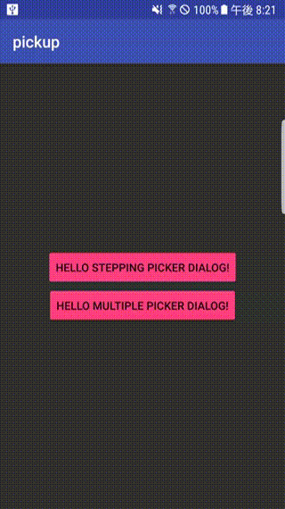
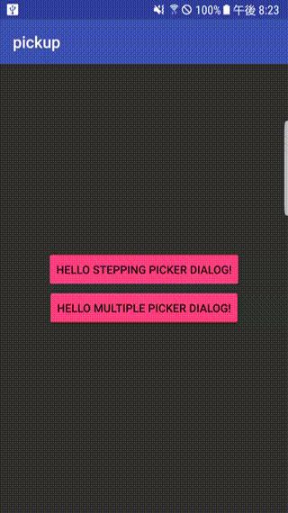

[](https://jitpack.io/#playmotion-inc/pickup)

# pickup
An advanced picker dialog library for Android written in Kotlin.




# Installation

## Add repositories in your root build.gradle

```
allprojects {
    repositories {
        maven { url "https://jitpack.io" }
    }
}
```

## Add the dependency in app module

```
dependencies {
    implementation("com.github.tatuas:pickup:$latest_version") {
        transitive = true
    }
}
```

# License

- MIT
